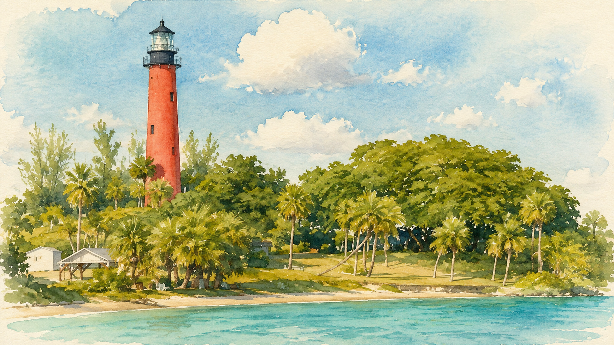
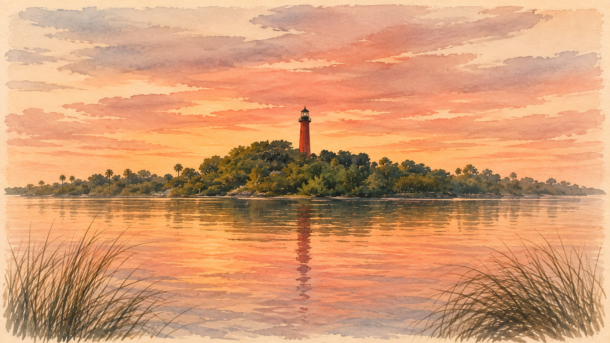
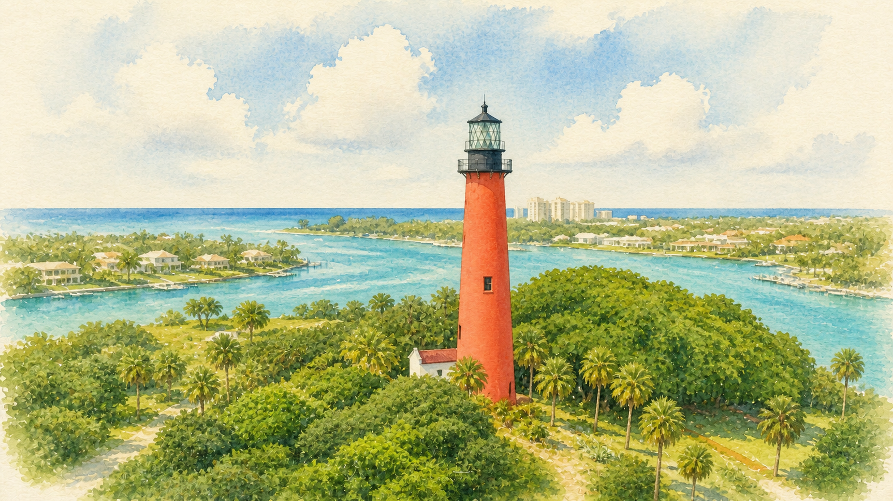
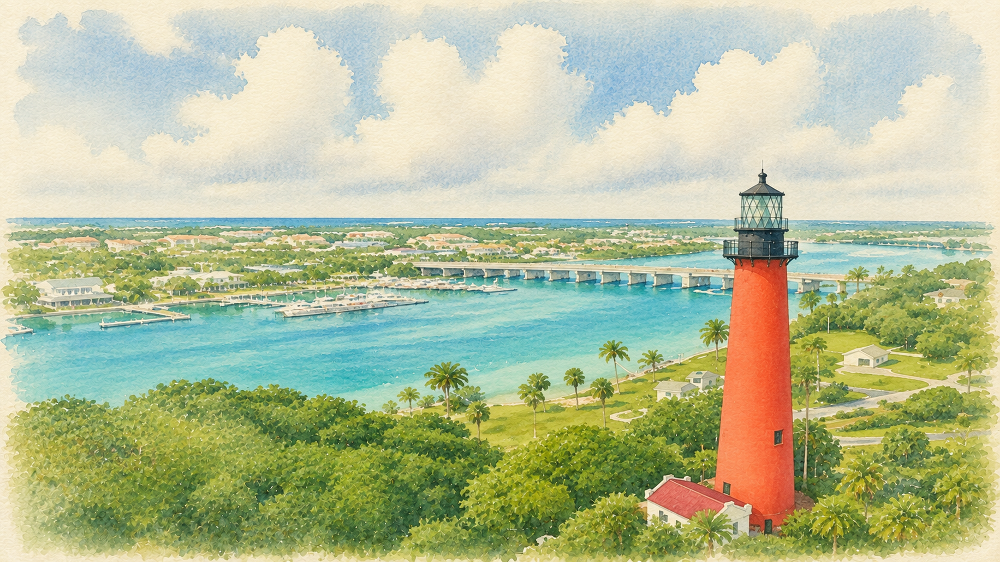

# Jupiter Lighthouse Light

A warm, coastal light theme for [Omarchy](https://omarchy.org), built around four original watercolor views of the Jupiter Inlet Lighthouse.

The palette pairs sun-washed ivory surfaces with mangrove green text, inlet blue and teal utility colors, and the lighthouse's muted coral as the primary accent. It uses Yaru's `prussiangreen` icon variant.

## Install

```bash
omarchy-theme-install https://github.com/rblalock/omarchy-jupiter-lighthouse-light-theme
```

Then choose **Jupiter Lighthouse Light** from Omarchy's theme menu. Use the background menu to move between the four included 4K wallpapers.

## Wallpapers

<table>
  <tr>
    <td align="center">
      <br>
      <sub>Shoreline</sub>
    </td>
    <td align="center">
      <br>
      <sub>Sunset</sub>
    </td>
  </tr>
  <tr>
    <td align="center">
      <br>
      <sub>Aerial Center</sub>
    </td>
    <td align="center">
      <br>
      <sub>Aerial Bridge</sub>
    </td>
  </tr>
</table>

All wallpapers are 3840 x 2160 PNGs.
